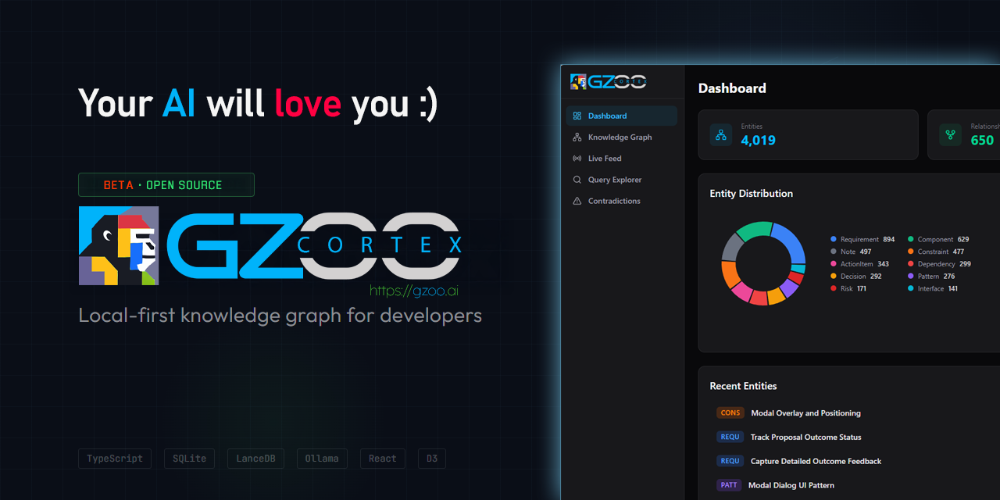

# GZOO Cortex

<p align="center">
  
</p>

**Local-first knowledge graph for developers.** Watches your project files,
extracts entities and relationships using LLMs, and lets you query across
all your projects in natural language.

> “What architecture decisions have I made across projects?”
>
> Cortex finds decisions from your READMEs, TypeScript files, config files,
> and conversation exports — then synthesizes an answer with source citations.

## Why

You work on multiple projects. Decisions, patterns, and context are scattered
across hundreds of files. You forget what you decided three months ago. You
re-solve problems you already solved in another repo.

Cortex watches your project directories, extracts knowledge automatically,
and gives it back to you when you need it.

## What It Does

- **Watches** your project files (md, ts, js, py, json, yaml) for changes
- **Extracts** entities: decisions, patterns, components, dependencies, constraints, action items
- **Infers** relationships between entities across projects
- **Detects** contradictions when decisions conflict
- **Queries** in natural language with source citations
- **Routes** intelligently between cloud and local LLMs
- **Respects** privacy — restricted projects never leave your machine
- **Web dashboard** with knowledge graph visualization, live feed, and query explorer
- **MCP server** for direct integration with Claude Code

## Quick Start

### 1. Install

```bash
npm install -g @gzoo/cortex
```

If global install fails with `EACCES`, use a user prefix instead:

```bash
mkdir -p ~/.local
npm config set prefix ~/.local
echo 'export PATH="$HOME/.local/bin:$PATH"' >> ~/.bashrc
source ~/.bashrc
npm install -g @gzoo/cortex
```

Or install from source:

```bash
git clone https://github.com/gzoonet/cortex.git
cd cortex
npm install && npm run build && npm link
```

Verify: `cortex --version` (current release: **0.7.1**)

### 2. Setup

Run the interactive wizard:

```bash
cortex init
cortex doctor                              # verify config, providers, and DB
```

This walks you through:
- **LLM provider** — Anthropic, Google Gemini, DeepSeek, Groq, OpenRouter, or Ollama (local)
- **API key** — saved securely to `~/.cortex/.env`
- **Routing mode** — cloud-first, hybrid, local-first, or local-only
- **Watch directories** — which directories Cortex should monitor
- **Budget limit** — monthly LLM spend cap

`cortex init` writes global config to `~/.cortex/cortex.config.json`. API keys go in `~/.cortex/.env`.

### 3. Register Projects

```bash
cortex projects add my-app ~/projects/app
cortex projects add api ~/projects/api
cortex projects list                       # verify
```

### 4. Ingest, Watch & Query

**Backfill existing files first** — the watcher only picks up new changes:

```bash
cortex ingest "~/projects/app/src/**/*.ts"   # one-shot backfill
cortex serve                                 # dashboard + API + file watcher (recommended)
```

| Command | What it does |
|---------|-------------|
| `cortex serve` | Web dashboard + API + file watcher (`ignoreInitial` — no re-ingest on start) |
| `cortex watch` | CLI-only file watcher (no dashboard) |
| `cortex ingest` | One-shot ingestion; events do **not** appear in the Live Feed |

> **Don't run `watch` and `serve` together** — they compete for file changes.
> The Live Feed shows real-time events from `cortex serve` only (file saves while the server is running).

```bash
cortex query "what caching strategies am I using?"
cortex query "what decisions have I made about authentication?"
cortex find "PostgreSQL" --expand 2
cortex contradictions
```

### 5. Web Dashboard

```bash
cortex serve                               # open http://localhost:3710
```

Remote access:

```bash
cortex serve --host 0.0.0.0
```

Auth is enforced automatically on non-localhost hosts. A bearer token is auto-generated and saved to `~/.cortex/.env` (read it with `grep CORTEX_SERVER_AUTH_TOKEN ~/.cortex/.env`). Open the dashboard once with `http://<host>:3710/?token=<token>` — the token is embedded only for requests that already prove possession of it and is then kept for the browser tab (so anonymous visitors never receive it). API/WebSocket calls behind a reverse proxy use `Authorization: Bearer <token>`.

### Excluding Files & Directories

Cortex ignores `node_modules`, `dist`, `.git`, and other common directories by default. To add more:

```bash
cortex config exclude add docs             # exclude a directory
cortex config exclude add "*.log"          # exclude by pattern
cortex config exclude list                 # see all excludes
cortex config exclude remove docs          # remove an exclude
```

## How It Works

Cortex runs a pipeline on every file change:

1. **Parse** — file content is chunked by a language-aware parser (tree-sitter for code, remark for markdown)
2. **Extract** — LLM identifies entities (decisions, components, patterns, etc.)
3. **Relate** — LLM infers relationships between new and existing entities
4. **Detect** — contradictions and duplicates are flagged automatically
5. **Store** — entities, relationships, and vectors go into SQLite + LanceDB
6. **Query** — natural language queries search the graph and synthesize answers

All data stays local in `~/.cortex/`. Only LLM API calls leave your machine
(and never for restricted projects).

## LLM Providers

Cortex is **provider-agnostic**. It supports:

- **Anthropic Claude** (Sonnet, Haiku) — via native Anthropic API
- **Google Gemini** — via OpenAI-compatible API
- **DeepSeek** (Reasoner, Chat) — strong reasoning, very affordable
- **Groq** — fast inference with free tier
- **Any OpenAI-compatible API** — OpenRouter, local proxies, etc.
- **Ollama** (Mistral, Llama, etc.) — fully local, no cloud required

Cost tracking uses provider-aware rates for DeepSeek, Gemini, Groq, and OpenRouter models — not a blanket Anthropic fallback.

### Routing Modes

| Mode | Cloud Cost | Quality | Ollama Required |
|------|-----------|---------|-----------------|
| `cloud-first` | Varies by provider | Highest | No |
| `hybrid` | Reduced | High | Yes |
| `local-first` | Minimal | Good | Yes |
| `local-only` | $0 | Good | Yes |

In **cloud-first** mode, all tasks route to your cloud provider. Ollama is not required and is only used if budget fallback is enabled. Hybrid mode routes high-volume tasks (entity extraction, ranking) to Ollama and reasoning-heavy tasks (relationship inference, queries) to your cloud provider.

## Requirements

- **Node.js** 20+
- **LLM API key** for cloud modes — Anthropic, Google Gemini, DeepSeek, Groq, or any OpenAI-compatible provider
- **Ollama** — only for `hybrid`, `local-first`, or `local-only` modes ([install](https://ollama.ai/))

## Configuration

Config is layered — later sources override earlier ones:

| Priority | Location | Scope |
|----------|----------|-------|
| 1 | Built-in defaults | Global |
| 2 | `~/.cortex/cortex.config.json` | Global (created by `cortex init`) |
| 3 | `./cortex.config.json` | Project overrides (optional) |
| 4 | `CORTEX_*` env vars | Session |

API keys are stored separately in `~/.cortex/.env` (never in config JSON).

```bash
cortex config list                       # see all non-default settings
cortex config set llm.mode hybrid        # switch routing mode
cortex config set llm.budget.monthlyLimitUsd 10  # set budget
cortex config exclude add vendor         # exclude a directory from watching
cortex privacy set ~/clients restricted  # mark directory as restricted
cortex doctor                            # validate setup
```

Full configuration reference: [docs/configuration.md](docs/configuration.md)

## Commands

| Command | Description |
|---------|-------------|
| `cortex init` | Interactive setup wizard |
| `cortex doctor` | Validate config, providers, projects, secrets, and database |
| `cortex projects add/list/remove/show` | Manage registered projects |
| `cortex serve` | Web dashboard + API + file watcher (port 3710) |
| `cortex watch [project]` | CLI-only file watcher |
| `cortex ingest <file-or-glob>` | One-shot file ingestion (separate from Live Feed) |
| `cortex query <question>` | Natural language query with citations |
| `cortex find <term>` | Find entities by name |
| `cortex status` | Graph stats, costs, provider status |
| `cortex costs` | Detailed cost breakdown |
| `cortex contradictions` | List active contradictions |
| `cortex resolve <id>` | Resolve a contradiction |
| `cortex models list/pull/test/info` | Manage Ollama models |
| `cortex mcp` | Start MCP server for Claude Code |
| `cortex report` | Post-ingestion summary |
| `cortex privacy set/list` | Set directory privacy |
| `cortex config list/get/set/validate` | Read/write configuration |
| `cortex config exclude add/remove/list` | Manage file/directory exclusions |
| `cortex stop` / `cortex restart` | Manage running watch/serve processes |
| `cortex db` | Database operations |

Full CLI reference: [docs/cli-reference.md](docs/cli-reference.md)

## Web Dashboard

Run `cortex serve` to open a full web dashboard at `http://localhost:3710` with:

- **Dashboard Home** — graph stats, recent activity, entity type breakdown
- **Knowledge Graph** — interactive D3-force graph with clustering, click to explore
- **Live Feed** — real-time file change and entity extraction events via WebSocket (from `cortex serve` only)
- **Query Explorer** — natural language queries with streaming responses
- **Contradiction Resolver** — review and resolve conflicting decisions

### Remote Deployment

For access beyond localhost, bind to all interfaces and put Cortex behind a reverse proxy:

```bash
cortex serve --host 0.0.0.0
```

Example nginx config — protect `/api/` and `/ws` with basic auth; serve static assets without auth (the dashboard injects the bearer token into HTML):

```nginx
location /api/ {
    auth_basic "Cortex";
    auth_basic_user_file /etc/nginx/.htpasswd;
    proxy_pass http://127.0.0.1:3710;
    proxy_set_header Authorization "Bearer $CORTEX_TOKEN";
}

location /ws {
    auth_basic "Cortex";
    auth_basic_user_file /etc/nginx/.htpasswd;
    proxy_pass http://127.0.0.1:3710;
    proxy_http_version 1.1;
    proxy_set_header Upgrade $http_upgrade;
    proxy_set_header Connection "upgrade";
}

location / {
    auth_basic off;
    proxy_pass http://127.0.0.1:3710;
}
```

Set `CORTEX_SERVER_AUTH_TOKEN` or `server.auth.token` in config. When auth is enabled, Cortex injects the token into the dashboard HTML so API and WebSocket calls authenticate automatically.

## MCP Server (Claude Code Integration)

Cortex includes an MCP server so Claude Code can query your knowledge graph directly:

```bash
claude mcp add cortex --scope user -- npx @gzoo/cortex mcp
```

This gives Claude Code **12 tools**:

| Tool | Description |
|------|-------------|
| `cortex_ask` | Natural language questions about your projects |
| `get_status` | System status and graph stats |
| `list_projects` | List registered projects |
| `find_entity` | Look up entities by name |
| `query_cortex` | Structured knowledge graph queries |
| `get_contradictions` | List detected contradictions |
| `resolve_contradiction` | Resolve a contradiction |
| `search_entities` | Search entities with filters |
| `ingest_file` | Trigger file ingestion |
| `add_project` | Register a new project |
| `remove_project` | Unregister a project |
| `session_brief` | Context summary for current session |

## Architecture

Monorepo with eight packages:

- **@cortex/core** — types, EventBus, config loader, error classes
- **@cortex/ingest** — file parsers (tree-sitter + remark), chunker, watcher, pipeline
- **@cortex/graph** — SQLite store, LanceDB vectors, query engine
- **@cortex/llm** — Anthropic/Gemini/OpenAI-compatible/Ollama providers, router, prompts, cache
- **@cortex/cli** — Commander.js CLI
- **@cortex/mcp** — Model Context Protocol server (stdio transport, 12 tools)
- **@cortex/server** — Express REST API + WebSocket relay
- **@cortex/web** — React + Vite + D3 web dashboard

Architecture docs: [docs/](docs/)

## Privacy & Security

- Files classified as `restricted` are **never** sent to cloud LLMs
- Sensitive files (.env, .pem, .key) are auto-detected and blocked
- API key secrets are scanned and redacted before any cloud transmission
- All data stored locally in `~/.cortex/` — nothing phones home

Full security architecture: [docs/security.md](docs/security.md)

## Built With

- [SQLite](https://sqlite.org/) via better-sqlite3 — entity and relationship storage
- [LanceDB](https://lancedb.com/) — vector embeddings for semantic search
- [Anthropic Claude](https://anthropic.com/) — cloud LLM provider
- [Google Gemini](https://ai.google.dev/) — cloud LLM provider (via OpenAI-compatible API)
- [DeepSeek](https://deepseek.com/) — cloud LLM provider (reasoning + chat)
- [Groq](https://groq.com/) — fast cloud inference
- [Ollama](https://ollama.ai/) — local LLM inference
- [tree-sitter](https://tree-sitter.github.io/) — language-aware file parsing
- [Chokidar](https://github.com/paulmillr/chokidar) — cross-platform file watching
- [Commander.js](https://github.com/tj/commander.js/) — CLI framework
- [React](https://react.dev/) + [Vite](https://vite.dev/) — web dashboard
- [D3](https://d3js.org/) — knowledge graph visualization

## Contributing

See [CONTRIBUTING.md](CONTRIBUTING.md) for guidelines.

## License

MIT — see [LICENSE](LICENSE)

## About

Built by [GZOO](https://gzoo.ai) — an AI-powered business automation platform.

Cortex started as an internal tool to maintain context across multiple
client projects. We open-sourced it because every developer who works on
more than one thing loses context, and we think this approach — automatic
file watching + knowledge graph + natural language queries — is the right
way to solve it.
